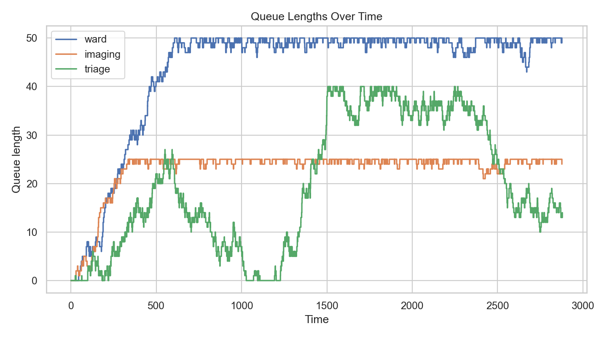
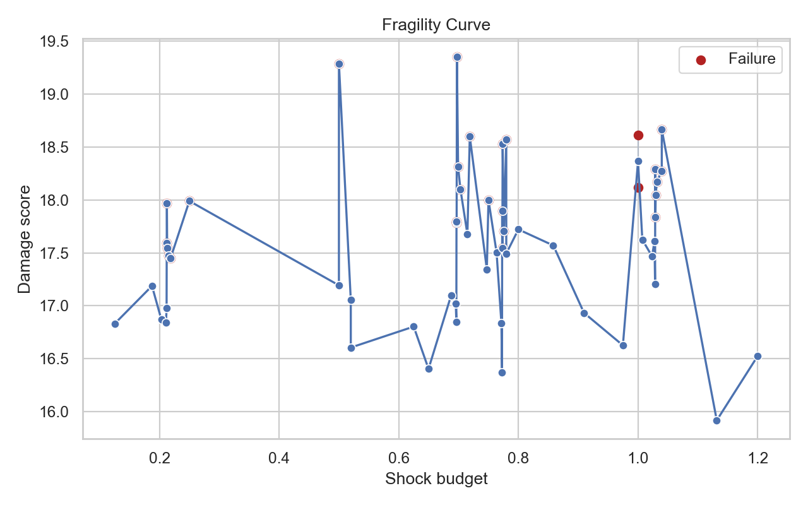
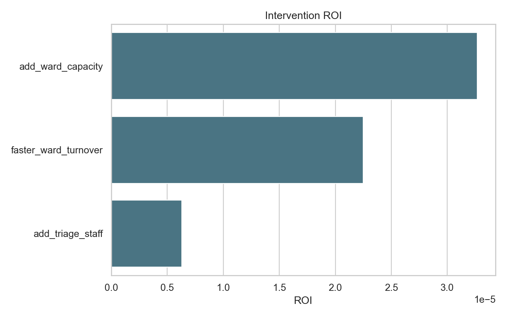

# StressLab

StressLab is an adversarial resilience-testing framework for queue, flow, and dependency networks. Define your system in YAML, inject realistic shocks, and discover the smallest scenario that causes failure and the interventions with the best resilience return on investment.

## Why it matters

Hospitals, supply chains, markets, and infrastructure systems fail through the same core mechanics:

- arrivals
- queues
- service constraints
- routing dependencies
- correlated shocks
- nonlinear collapse thresholds

StressLab packages those mechanics into a reproducible open-source workflow for resilience fuzzing.
It now also includes a discovery-engine layer for synthetic-system generation, collapse-law search,
and publication-style research artifacts, turning the project into a lightweight computational lab
for systemic fragility.

It now models both node bottlenecks and route bottlenecks, including constrained transfer links,
blocked downstream movement, edge delay, and edge-targeted shocks.
It also groups robust stress portfolios into scenario families and scores which interventions
actually cover each family, turning robust optimization into a more actionable planning workflow.
Budgeted robust optimization now goes one step further and recommends portfolio plans: small
sets of interventions chosen to cover the widest range of failure families under a fixed budget.
It now also measures class-level equity, computes fairness degradation, and supports
fairness-aware optimization for systems where average performance can hide unequal harm.
It can now synthesize queue and routing policy candidates directly from a system definition,
so optimization is no longer limited to only the interventions hand-authored in YAML.
It now also supports scheduled policy hooks, so queue discipline and routing bias can change
during a run and be optimized as timed operating rules rather than only static configuration.
It can now also synthesize adaptive controllers that activate on congestion thresholds, letting
StressLab recommend operational rules like "switch to priority when triage queue exceeds 4"
instead of only fixed-time policies.
Adaptive controllers can also be multi-stage escalation ladders, so operating rules can intensify
as congestion worsens instead of relying on a single trigger level.
StressLab can now also synthesize coordinated controller bundles, packaging multiple adaptive
policies into one playbook candidate for cross-target response planning.
It can now also synthesize hierarchical playbooks, nesting controller bundles with supporting
controllers so the optimizer can recommend escalation plans instead of only flat controller sets.
Robust planning now also builds regime-aware response maps, assigning the best intervention or
playbook to each discovered scenario family and estimating the standby cost of keeping that
contingency map available.
It now also stress-tests those response maps under imperfect regime detection, using noisy
signal-based classification to estimate confusion, resilience regret, and how much value survives
when the system misclassifies a failure family.
It now also evaluates online regime detection from partial run observations, estimating whether
the system can identify the active failure family early enough for the planned response map to
matter before degradation is already underway.
StressLab now also replays those response maps with actual mid-run intervention deployment,
producing response-timing curves that show how quickly resilience value decays as deployment is
delayed.
It now also supports closed-loop regime control evaluation, where the system periodically observes
the live run, predicts the active failure family, and deploys interventions inside the same replay.
That closed-loop controller is now tuned automatically on representative scenario families, so the
observation schedule and confidence threshold are learned from the stress portfolio instead of
being fixed by hand.
The tuner now also mutates controller schedules around strong seeds and can require repeated
high-confidence confirmation before deployment, which makes the learned policy less brittle than a
single-threshold trigger.
It now also learns schedule shape parameters directly, including first observation time, interval
spacing, interval growth, and observation budget, so controller cadence is optimized as a policy
surface rather than only as a named template.
That controller learner now also runs a local-search pass around strong candidates and emits a
controller frontier, so teams can compare resilience against monitoring burden instead of blindly
accepting the single highest-scoring policy.
StressLab now also supports batch experiment manifests and cross-run comparison reports, so teams
can orchestrate resilience campaigns instead of only running one-off analyses.
It now also supports workspace cataloging, so runs, comparisons, batches, and benchmark suites
can be inventoried into one report instead of getting lost in nested directories.
The CLI now also maintains a lightweight workspace registry and can build a status snapshot from
that registry, which makes it easier to see what has been run recently without rescanning or
manually browsing nested output folders.
It now also builds a workspace board from that registry, which surfaces system leaders, failure
watchlists, and the strongest optimize plans in one operator-facing report.
It now also ships a lightweight HTTP service over the workspace registry and artifact tree, so
external tools can query runs, plans, reports, and workspace summaries programmatically.
It can now also package runs, boards, and other artifact directories into portable bundles with
checksums and restore them into another workspace, which makes handoff and reproducible review much
easier.
It now also supports multi-seed evaluation studies, so recommended plans can be tested with
replication, paired deltas, and confidence intervals instead of relying on one seed.
It now also supports evidence casebooks, which aggregate those evaluation studies across systems
into a shareable validation report.

## Installation

```bash
pip install -e .
```

For development tools:

```bash
pip install -e .[dev]
```

## Quickstart

```bash
stresslab generate --count 200 --topology-type mixed
stresslab discover --count 200 --topology-type mixed --workers 4
stresslab discover --count 2000 --topology-type mixed --shard-count 4 --shard-index 0 --workers 4
stresslab discover --resume-run-dir runs/<discover_dir> --workers 4
stresslab theory runs/<discover_dir>
stresslab theory runs
stresslab research runs/<discover_dir>
stresslab batch examples/campaigns/universal_fragility_pipeline.yml
stresslab batch examples/campaigns/healthcare_referral_fragility.yml
stresslab batch examples/campaigns/supply_chain_cascade_study.yml
stresslab batch examples/campaigns/market_microstructure_fragility.yml
stresslab validate examples/healthcare/ed_basic.yml
stresslab run examples/healthcare/ed_basic.yml
stresslab search examples/healthcare/ed_basic.yml --objective min_failure
stresslab optimize examples/healthcare/ed_basic.yml --budget 2500
stresslab optimize examples/healthcare/ed_basic.yml --robust --scenario-budget 0.4 --scenario-samples 3 --budget 2500
stresslab optimize examples/healthcare/ed_basic.yml --robust --scenario-budget 0.4 --scenario-samples 3 --budget 2500 --fairness-weight 0.35
stresslab compare runs/<run_a> runs/<run_b>
stresslab batch examples/campaigns/healthcare_decision_campaign.yml
stresslab catalog runs
stresslab status runs --refresh
stresslab board runs --refresh
stresslab doctor runs
stresslab serve runs --refresh --port 8765 --api-token change-me
# then open http://127.0.0.1:8765/app?token=change-me in a browser
curl -X POST http://127.0.0.1:8765/jobs -H "Content-Type: application/json" -d "{\"command\":\"run\",\"spec_path\":\"examples/healthcare/ed_basic.yml\"}"
stresslab bundle runs/<run_dir> --output-dir bundles --include-registry
stresslab restore bundles/<run_bundle>.zip --output-dir runs
stresslab evaluate examples/healthcare/ed_basic.yml --replicates 8 --budget 2500 --robust
stresslab casebook --suite starter --replicates 4
stresslab optimize examples/markets/liquidity_withdrawal.yml --robust --scenario-budget 0.4 --scenario-samples 2 --budget 500 --fairness-weight 0.5 --expand-policies --policy-only
stresslab optimize examples/healthcare/ed_basic.yml --robust --scenario-budget 0.4 --scenario-samples 2 --budget 600 --expand-dynamic-policies --dynamic-only
stresslab optimize examples/healthcare/ed_basic.yml --robust --scenario-budget 0.4 --scenario-samples 2 --budget 700 --expand-adaptive-policies --adaptive-only
stresslab optimize examples/healthcare/ed_basic.yml --expand-adaptive-policies --expand-controller-bundles --bundle-only --budget 900
stresslab optimize examples/healthcare/ed_basic.yml --expand-adaptive-policies --expand-controller-bundles --expand-hierarchical-playbooks --playbook-only --budget 1200
```

The baseline run writes a timestamped artifact directory under `runs/` containing:

- `baseline_result.json`
- `metrics.csv`
- `node_metrics.csv`
- `edge_metrics.csv`
- `class_metrics.csv`
- `policy_schedule.csv`
- `queue_lengths.png`
- `class_fairness.png`
- `policy_schedule.png`
- `bottleneck_heatmap.png`
- `system_graph.png`
- `report.md`
- `report.html`

Robust optimization runs additionally emit:

- `scenario_summary.csv`
- `scenario_clusters.csv`
- `cluster_summary.csv`
- `intervention_coverage.csv`
- `portfolio_candidates.csv`
- `portfolio_cluster_coverage.csv`
- `cluster_response_plan.csv`
- `regime_plan_summary.json`
- `regime_detection.csv`
- `regime_detection_confusion.csv`
- `regime_detection_summary.json`
- `online_regime_detection.csv`
- `online_regime_horizons.csv`
- `online_regime_summary.json`
- `response_timing.csv`
- `response_timing_summary.json`
- `closed_loop_regime.csv`
- `closed_loop_regime_summary.json`
- `controller_policy_candidates.csv`
- `controller_frontier.csv`
- `controller_tuning_summary.json`
- `intervention_catalog.csv`
- `bundle_hierarchy.csv`
- `pareto_frontier.csv`
- `policy_schedule.csv`
- `scenario_clusters.png`
- `intervention_coverage.png`
- `portfolio_tradeoff.png`
- `policy_schedule.png`
- `response_timing.png`
- `closed_loop_regime.png`
- `controller_tuning.png`
- `controller_frontier.png`

Discovery-engine runs additionally emit:

- `generated/*.yml`
- `collapse_dataset.csv`
- `early_warning_dataset.csv`
- `collapse_distribution.csv`
- `feature_importance.csv`
- `candidate_laws.csv`
- `symbolic_laws.csv`
- `combined_collapse_dataset.csv`
- `source_dataset_index.csv`
- `phase_transition_bootstrap.csv`
- `tail_model_comparison.csv`
- `early_warning_trends.csv`
- `fragility_curves.png`
- `cascade_distribution.png`
- `collapse_heatmap.png`
- `law_discovery.png`
- `discovery_report.html`
- `theory_report.html`
- `research_report.html`

## Example output

Queue lengths:



Fragility curve:



Intervention ROI:



## Architecture summary

- `stresslab.systemspec` parses and validates YAML system definitions.
- `stresslab.des` runs deterministic discrete-event simulations with queues, routing, priorities, buffers, shocks, and constrained transfer links.
- `stresslab.des` also tracks class-level waits, drops, departures, and fairness metrics.
- `stresslab.search` performs minimum-failure and budgeted worst-case search with replayable scenario histories.
- `stresslab.generator` creates valid synthetic SystemSpecs across multiple topology families.
- `stresslab.theory` extracts structural features, collapse metrics, phase transitions, power-law fits, and early-warning indicators.
- `stresslab.discovery` runs generation-plus-search campaigns and assembles collapse datasets plus candidate-law artifacts.
- `stresslab.discovery` now also supports symbolic-style law search, resumable campaigns, and multi-worker discovery execution.
- Discovery execution now also supports deterministic shard splitting, so very large synthetic studies can be distributed across multiple local or scheduled jobs and merged later through `stresslab theory`.
- `stresslab.research` builds theory reports and publication-style research bundles.
- `stresslab.optimize` ranks interventions and builds greedy budgeted portfolios.
- `stresslab.optimize` also supports robust multi-scenario intervention ranking for planning under uncertainty.
- Optimization runs now emit Pareto frontiers so users can inspect efficient tradeoffs instead of only one ranked list.
- Robust optimization also clusters stress scenarios into failure families and produces intervention coverage maps.
- With a budget, robust optimization now searches for portfolio plans that maximize both resilience and failure-family coverage.
- Robust optimization also builds regime-aware response maps that recommend different interventions for different scenario families and track the standby cost of that contingency plan.
- Robust optimization also evaluates those response maps under imperfect regime detection and reports confusion, accuracy, and resilience regret under noisy signals.
- Robust optimization now also evaluates online regime detection from partial observations and reports horizon-by-horizon accuracy, pre-degradation decision rate, and delay-adjusted resilience.
- Robust optimization now also replays regime-plan interventions at different deployment times and reports how much response value survives as deployment is delayed.
- Robust optimization now also evaluates closed-loop regime control, where runtime observations drive confidence-gated intervention deployment inside the replay itself.
- Robust optimization now also tunes that closed-loop controller on representative scenario families and reports the chosen schedule, confidence threshold, and candidate tradeoffs.
- Controller learning now also runs a local-search pass over schedule-shape parameters, repeated-confirmation rules, and confidence thresholds.
- Robust controller analysis now emits a controller frontier so users can inspect resilience-versus-monitoring-burden tradeoffs.
- `stresslab compare` now builds cross-run decision reviews with comparable metrics and tradeoff plots.
- `stresslab batch` now executes repeatable experiment manifests, including chained discovery studies such as `generate -> discover -> theory -> research`.
- The repository now ships flagship study manifests for mixed, healthcare-style, supply-chain, and market-style discovery campaigns under [examples/campaigns](C:/Users/saule/Desktop/stresslab/examples/campaigns).
- `stresslab catalog` now scans a workspace and builds an inventory of discovered runs, comparisons, batches, and benchmark suites.
- `stresslab status` now turns the workspace registry into a recent-activity snapshot with timeline and mix plots.
- `stresslab board` now turns that same registry into a decision dashboard with leaders, watchlists, and optimize-plan tradeoffs.
- `stresslab doctor` now emits a deployment-preflight report covering Docker CLI, buildx, daemon reachability, WSL, and Windows container readiness.
- `stresslab serve` now exposes the workspace over HTTP with registry, status, board, artifact, report, file, and async job endpoints.
- The service now also ships an interactive browser app at `/app` for live workspace monitoring, job submission, artifact inspection, and side-by-side decision review.
- The service can now also be secured with an API token and shipped with container assets for Docker-based deployment.
- `stresslab bundle` and `stresslab restore` now support portable artifact handoff with manifests and checksums.
- The HTTP API can now also stream portable bundles directly from `/bundles/<run_id>`.
- The service layer now also persists submitted jobs in SQLite and exposes `POST /jobs`, `GET /jobs`, and `GET /jobs/<job_id>` for asynchronous orchestration.
- `stresslab evaluate` now runs multi-seed replication studies with paired deltas and confidence intervals for proposed plans.
- `stresslab casebook` now aggregates multiple evaluation studies into a cross-system evidence report.
- Fairness-aware optimization is available through `--fairness-weight` when users need to trade resilience against class inequity.
- `--expand-policies` and `--policy-only` let StressLab synthesize queue-policy and routing-policy candidates directly from the model topology.
- `--expand-dynamic-policies` and `--dynamic-only` synthesize scheduled policy candidates anchored to stress windows so the optimizer can recommend timed operating rules.
- `--expand-adaptive-policies` and `--adaptive-only` synthesize threshold-triggered controllers that activate on live congestion signals like queue length and utilization.
- `--expand-controller-bundles` and `--bundle-only` synthesize coordinated playbooks that package multiple adaptive controllers into one candidate.
- `--expand-hierarchical-playbooks` and `--playbook-only` synthesize nested playbooks that bundle controller bundles with supporting rules and emit hierarchy artifacts for review.
- `stresslab.explain` summarizes bottlenecks, critical edges, blockers, and mitigation counterfactuals.
- `stresslab.viz` and `stresslab.reports` generate plots, comparison tables, and Markdown/HTML reports.
- The `/app` browser control center now includes a dedicated Discovery Lab view for recent synthetic studies, top symbolic laws, and research figures.
- `stresslab.cli` exposes the full workflow through the `stresslab` command.

## Project structure

```text
stresslab/
  Dockerfile
  docker-compose.yml
  stresslab/
  examples/
  tests/
  docs/
  notebooks/
  .github/workflows/
```

## Required examples

- `examples/healthcare/ed_basic.yml`
- `examples/supply_chain/two_supplier_port.yml`
- `examples/markets/liquidity_withdrawal.yml`
- `examples/campaigns/healthcare_decision_campaign.yml`

## Roadmap

- v0.1: validated YAML specs, DES kernel, shocks, search, optimization, reporting, examples, tests
- v0.2: richer topology shocks, benchmark leaderboards, Pareto intervention outputs, scenario-family coverage analysis, robust portfolio planning, fairness-aware optimization
- v0.3: Bayesian and evolutionary search, notebook tutorials, richer dashboards
- v1.0: differentiable approximations, live adapters, multi-system coupling

## Contributing

StressLab favors correctness before performance and clarity before cleverness. Start with:

1. `pip install -e .[dev]`
2. `ruff check .`
3. `pytest`
4. `stresslab run examples/healthcare/ed_basic.yml`

## Deployment

Container and service deployment guidance is in [docs/deployment.md](docs/deployment.md).
5. `stresslab benchmark --suite starter`

See [docs/contributing.md](docs/contributing.md) for the short contributor guide.
