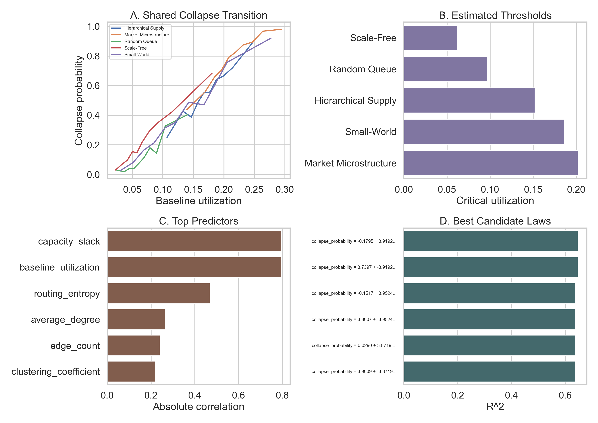

## Flagship Result

Across 5,000 synthetic systems spanning random queue, scale-free, small-world, hierarchical supply, and market microstructure networks, StressLab found a shared collapse transition band: collapse risk accelerates sharply once baseline utilization enters roughly the 0.10 to 0.19 range.

The follow-up study sharpened that claim. In a controlled sweep over 2,700 fixed-size synthetic systems plus 144 healthcare variants, coupling changed the threshold only modestly on average, but reduced the shock margin to failure by about 39.2%. The strongest public-facing conclusion is:

> Across domains, collapse thresholds are primarily utilization-led; coupling mainly narrows the failure margin rather than moving the threshold much.

Why this matters:

- It suggests many operational networks fail through a shared utilization cliff rather than purely domain-specific rules.
- It turns resilience planning into a question of distance to collapse and remaining shock margin.
- It makes StressLab more than a simulator: it is a discovery engine for systemic fragility laws.
- It can now be shown for free on GitHub Pages through a static demo backed by precomputed StressLab scenarios.
